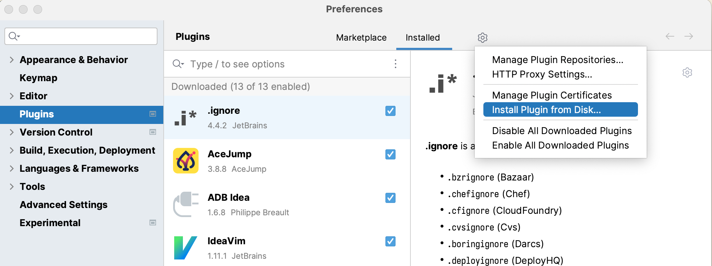
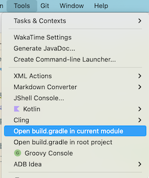
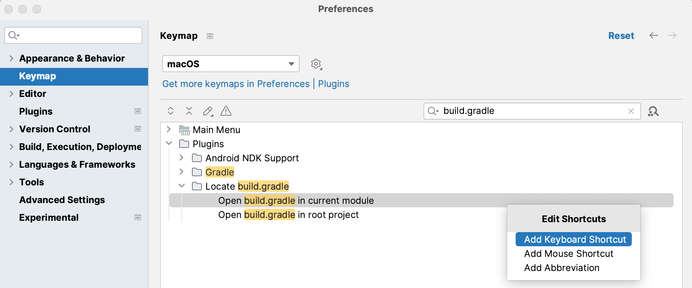

# Locate Build Gradle

Quick to open the `build.gradle(.kts)` file in multi-module project.

## Installation

Download the latest plugin jar from [releases](./releases) folder.

Install the jar in Android Studio via Preferences -> Plugins -> Install Plugin from Disk...



## Usage

You can find two actions in `Tools` menu.



## Shortcut

You can add your favorite shortcuts to these actions.



## Work with [IdeaVim](https://github.com/JetBrains/ideavim)

```
" Open build.gradle
nnoremap <Leader>fb :action LocateBuildGradle.OpenLocalFile<CR>
" Open build.gradle in root project
nnoremap <Leader>fB :action LocateBuildGradle.OpenRootFile<CR>
```

## Changelog

See [CHANGELOG.md](./CHANGELOG.md)